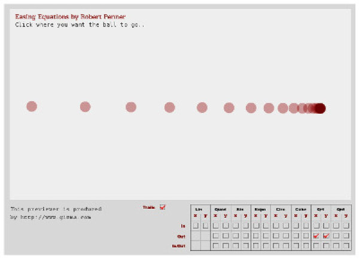

# Tilt Servo and Function Documentation

## Tilt Servo Control Functions

Before exploring the configuration, it's essential to understand the functions that control the tilt servo in the u360gts system. The tilt servo system consists of three essential components. The tilt angle is determined by calculating the vertical tilt angle based on relative altitude and distance between the target and tracker, with a maximum limit of 90 degrees. The tilt servo's position is updated to align with the desired angle, and it can apply smoothing for movement if enabled. Additionally, the system manages its activity, making decisions about whether the tracking system should be active or in a resting state. This includes functionalities such as telemetry loss detection and tracking decisions based on relative distance and altitude.

## Tilt Servo Configuration

Here are the configuration parameters that allow you to customize the tilt servo's operation:

- **tilt_pin**
  - Type: Integer
  - Valid Range: 0 to 7
  - Defines the pin number used to control the tilt servo on your hardware.

- **tilt0**
  - Type: Integer
  - Valid Range: 0 to 3000
  - Configures the PWM value corresponding to the 0-degree position of the tilt servo on your hardware.

- **tilt90**
  - Type: Integer
  - Valid Range: 0 to 3000
  - Defines the PWM value corresponding to the 90-degree position of the tilt servo on your hardware.

- **tilt_max_angle**
  - Type: Integer
  - Valid Range: 0 to 90
  - Configures the maximum angle to which the tilt servo can be tilted. This limits the tilt range.

## Easing Effect

The u360gts firmware provides a smoothing effect for the tilt servo's movement, especially useful for large antennas. This smoothing effect involves the tilt servo moving with deceleration towards the end, creating a damping effect.

The image below illustrates the smoothing effect for the "Easing Out Quart" function, one of the available options.



### Activate the Easing Effect
To activate the Easing smoothing effect, use the following command:
```plaintext
feature easing
```
### Deactivate the Easing Effect

To deactivate the Easing smoothing effect, use the following command:
```
feature -easing
```

The following parameters allow you to adjust the smoothing of the tilt servo's movement:

- **easing**
  - Type: Integer
  - Valid Values: 0, 1, 2, 3, 4 (see Easing Functions section)
  - Selects the type of smoothing function applied to the tilt servo's movement. Options include no smoothing and two different smoothing types.

- **easing_steps**
  - Type: Integer
  - Valid Range: 0 to 100
  - Defines the number of steps used in the smoothing function (if enabled). More steps result in smoother movement but may require more processing resources.

- **easing_min_angle**
  - Type: Integer
  - Valid Range: 1 to 10
  - Configures the minimum angle required for the smoothing function to be applied. This avoids smoothing small changes in the tilt angle.

- **easing_millis**
  - Type: Integer
  - Valid Range: 1 to 100
  - Sets the time in milliseconds during which the smoothing function is applied to the tilt servo's movement.

## Easing Functions

The u360gts firmware provides several easing functions that allow you to control the smoothing effect applied to the tilt servo's movement. These functions affect the rate of change of the tilt angle during tracking. Below are the available easing functions:

- **Ease Out Quart (1)**
  - This easing function produces a smooth deceleration effect towards the end of the tilt servo's movement. It results in a damping effect.

- **Ease Out Circular (2)**
  - EASE_OUT_CIRC creates a more linear slowing down effect compared to the quart function.

- **Ease Out Exponential (3)**
  - EASE_OUT_EXPO results in an exponential deceleration effect, gradually slowing down the tilt servo.

- **Ease Out Cubic (4)**
  - EASE_OUT_CUBIC creates a cubic deceleration effect, gradually slowing down the tilt servo's movement.

You can choose one of these easing functions to control the smoothing effect during tilt servo movement by configuring the `easing` parameter.

Please refer to the firmware documentation for more details on configuring and using these easing functions.

[<< Go back](README.md)
