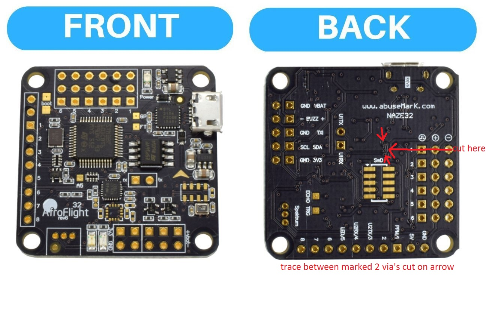
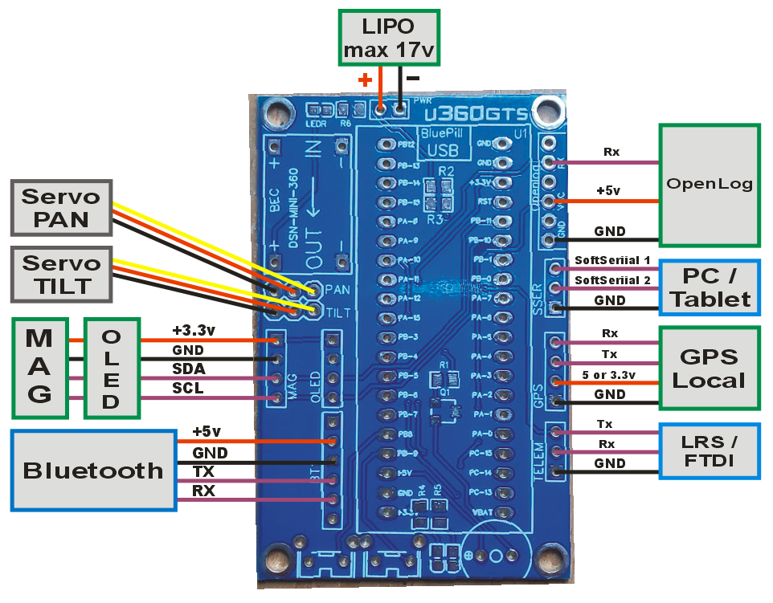
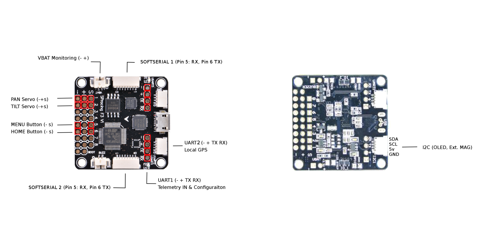

# Wiring Schematics

## Naze32

### Rev6 boards

Naze32 Rev6 boards might fail to receive telemetry due to the USB-Serial chip blocking communications; you may need to cut two traces on the board as reported by [jelle737 on RCGroups](https://www.rcgroups.com/forums/showpost.php?p=38456993&postcount=9). You will then have to use an external USB-Serial/FTDI adapter to connect to the board's UART1 instead of the usual Micro-USB connector.

## Flip32

## Bluepill

## Ariel'S PDB for Bluepill

## SP Racing F3

