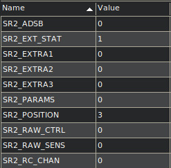
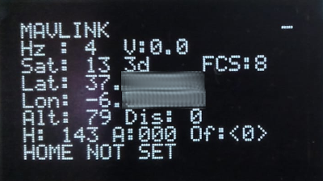

# Configuring Mavlink Telemetry for u360gts Firmware

The u360gts firmware supports MAVLink telemetry protocol versions v1 and v2, compatible with ArduPilot autopilots. Proper configuration of SRx message parameters is necessary to ensure that position data is received at an optimal frequency.

## Required MAVLink Messages

The u360gts firmware requires only two specific MAVLink message types to receive all necessary telemetry data for tracking the aircraft's position: `GPS_RAW_INT` and `GLOBAL_POSITION_INT`. A third message, `ATTITUDE`, is also parsed by the firmware; however, it is not used for tracking. Instead, it is relayed for use by other devices that require attitude data.

**GPS_RAW_INT (MSG_ID = 24):**

This message provides essential GPS data for tracking:

- Latitude
- Longitude
- Satellites (number of satellites in view)
- Altitude
- Fix Type (indicating the GPS fix quality)
- Speed

**GLOBAL_POSITION_INT (MSG_ID = 33):**

This message provides global positioning data:

- Latitude
- Longitude
- Altitude 

**ATTITUDE **(optional):

This message provides global positioning data:

- Pitch
- Roll
- Yaw
- Course

## SRx Parameter Configuration (Ardupilot)

To set up MAVLink telemetry for the u360gts firmware, configure the following SRx parameters on the autopilot:

- **SRx_EXT_STAT:** `GPS_RAW_INT`
- **SRx_POSITION:** `GLOBAL_POSITION_INT`
- **SRx_EXTRA1** (optional): `ATTITUDE`

The following is an example of SR parameter configuration for the SERIAL2 port on an ArduPlane-controlled aircraft.

In this setup, the GPS_RAW_INT message is received once, and the GLOBAL_POSITION_INT message three times, achieving a position data frequency of up to 4 Hz.

This rate is ideal for smooth tracking of an aircraft flying at a distance of 100 meters.

**Note:** Read more about [SRx_ parameters](https://ardupilot.org/dev/docs/mavlink-requesting-data.html).

## Mavlink Rates message (iNav)

The iNav control firmware also allows adjustment of the MAVLink message rate using the following parameters:

- mavlink_ext_status_rate
- mavlink_extra1_rate
- mavlink_extra2_rate
- mavlink_extra3_rate
- mavlink_pos_rate
- mavlink_rc_chan_rate

**Note:** For detailed information on configuring these parameters and managing MAVLink message outputs, please refer to the official [iNav documentation](https://github.com/iNavFlight/inav).

## Conclusion

By configuring these settings, the firmware will receive essential telemetry data for precise position tracking. Additionally, optional attitude data can be relayed to other devices if required, enhancing flexibility for diverse tracking and monitoring applications.

